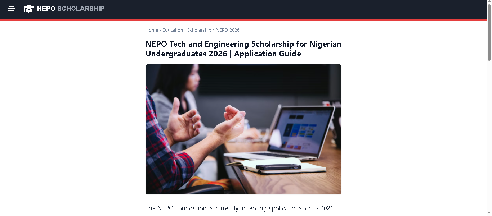
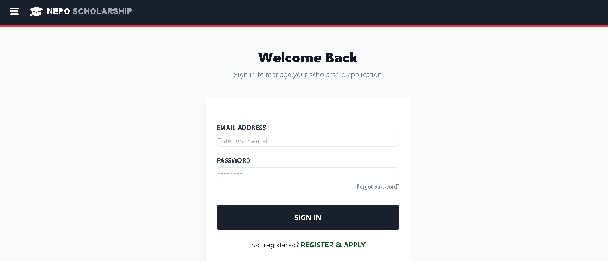
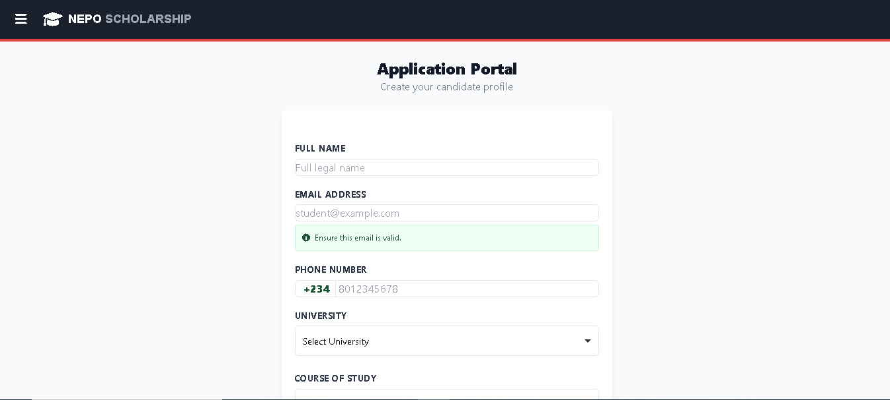
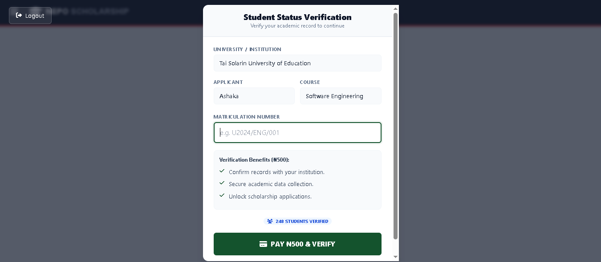
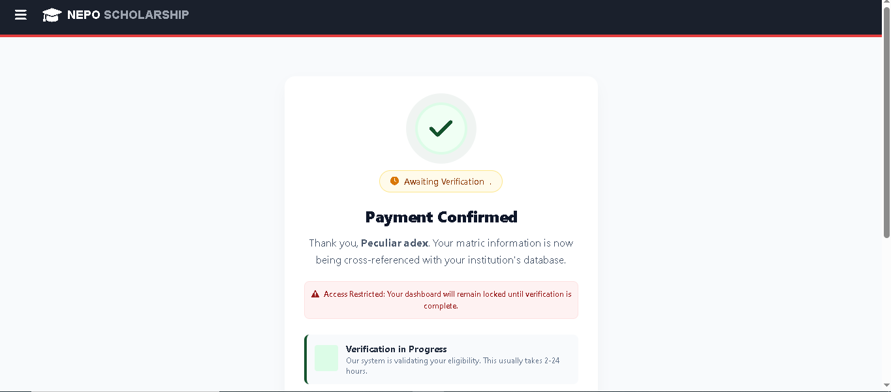
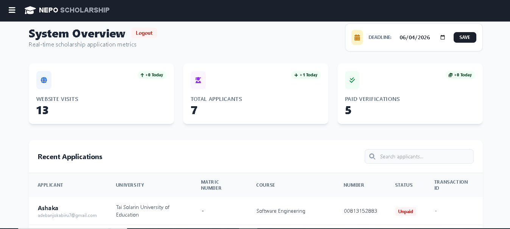

# ScholarFlow Portal 🎓

A full-stack scholarship application management system built with **Django**. This platform streamlines the journey from student application to admin oversight, featuring secure authentication and integrated payment verification.

## 🚀 Key Features
* **User Authentication:** Secure login/registration for students to manage their profiles.
* **Application Tracking:** Students can submit matriculation details and monitor their selection status.
* **Payment Integration:** Integrated payment gateway (Test Mode) to verify student eligibility and process fees.
* **Admin Command Center:** High-level overview of site visits, applicant data management, and dynamic deadline controls.

---

## 📸 System Overview

### 1. The Student Journey
**Homepage & Discovery** 

**Authentication** 

**Application Form** 

**Payment & Verification (Test Mode)** 

**Success Confirmation** 

---

### 2. Administrative Control
**Management Dashboard** *Monitor applicants, view site traffic, and update deadlines in real-time.*

---

## 🛠️ Tech Stack
* **Backend:** Django (Python)
* **Frontend:** HTML5, CSS3, JavaScript
* **Database:** SQLite (Development)
* **Tools:** VS Code, Git

📋 Requirements & Setup

To get this project running locally on your machine:

1. Clone the repository:

git clone https://github.com/T-I-W-O/ScholarFlow-Portal.git
cd ScholarFlow-Portal

2. Install Django:

pip install django

3. Database Setup:

python manage.py migrate

4. Run the Server:

python manage.py runserver

5. Open your browser at http://127.0.0.1:8000/ to view the app.

> Note: This project is integrated with the Paystack API. It is currently running in Test Mode, allowing for full end-to-end testing of the scholarship verification flow without processing real currency.
